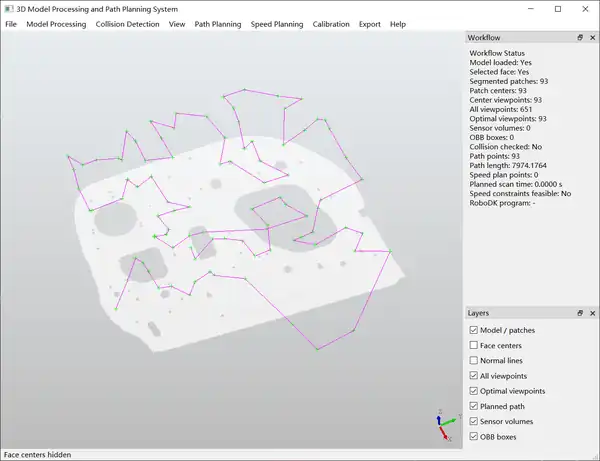
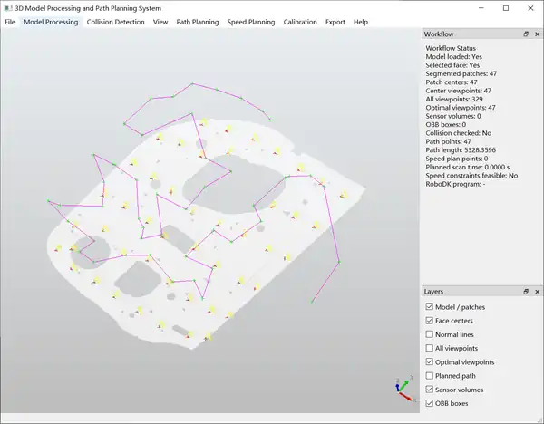

# 3D Scanning Measurement Path Planning Software

**English** | [中文](README_zh-CN.md)

A research-oriented desktop application for **CAD-based robotic scanning and measurement path planning**. The project integrates 3D model processing, surface segmentation, viewpoint generation, open-path optimization, speed planning, pose transformation, and RoboDK-based UR10 reachability analysis into a unified workflow.

## Software Demonstration

The following screenshots illustrate representative stages of the software workflow, including surface sampling/viewpoint generation and path-planning results under different segmentation settings.

### 1. Surface sampling and viewpoint generation

<p align="center">
  
</p>

### 2. Path planning result with 93 segmented patches

<p align="center">
  
</p>

### 3. Path planning result with 47 segmented patches

<p align="center">
  
</p>

## Main Capabilities

- **3D CAD processing**
  - CAD model loading and visualization based on OpenCASCADE / PythonOCC.
  - Surface segmentation and workpiece coordinate-system construction.
  - Interactive layer/display management for model, viewpoints, paths, and related geometric elements.

- **Scanning viewpoint generation**
  - Surface-normal-based viewpoint generation.
  - Center and multi-candidate viewpoint generation.
  - Viewpoint filtering and pose retention for subsequent planning and robot validation.

- **Path planning**
  - Sequential open path.
  - Greedy nearest-neighbor open path.
  - Artificial Bee Colony (ABC) solver.
  - Multi-Strategy Combined Genetic Algorithm (MSCGA).
  - MSCGA combines multiple crossover/mutation operators with **2-opt local search** for open-path optimization.

- **Speed planning and export**
  - Path speed planning and visualization.
  - CSV export for downstream analysis and robot execution workflows.

- **RoboDK / UR10 integration**
  - Import planned paths and speed-planned paths into RoboDK.
  - Read and manage RoboDK station/frame/tool mappings.
  - Load scanner-to-tool extrinsic calibration and transform planned poses.
  - Check UR10 reachability using RoboDK inverse kinematics, model joint limits, and forward-kinematics residual verification.
  - Repair unreachable path points by searching reachable candidates from the **same CAD surface patch**, considering local path-length variation and joint discontinuity, followed by optional re-planning.

- **Bilingual interface and tests**
  - Chinese and English UI resources under `locales/`.
  - Unit tests for planning-related utilities, surface segmentation, speed planning, RoboDK integration, reachability repair, i18n, and coordinate-system logic.

## Typical Workflow

```text
Import CAD model
      ↓
Surface segmentation / workpiece coordinate system
      ↓
Generate candidate scanning viewpoints
      ↓
Filter/select viewpoints and retain poses
      ↓
Plan open scanning path
(Sequential / Greedy / ABC / MSCGA)
      ↓
Speed planning
      ↓
Pose / calibration transformation
      ↓
RoboDK import
      ↓
UR10 reachability check
      ↓
Repair unreachable points / optional re-planning
      ↓
Export and downstream validation
```

## Path Planning Algorithms

| Method | Role in the software | Main characteristic |
| --- | --- | --- |
| Sequential | Baseline | Preserves the original viewpoint order |
| Greedy | Fast heuristic | Repeatedly selects the nearest unvisited viewpoint |
| ABC | Metaheuristic comparison | Artificial Bee Colony-based 3D open-path optimization |
| MSCGA | Main research algorithm | Multi-strategy GA with ordered/PMX/cycle crossover, multiple mutation operators, and 2-opt local search |

The repository is intended as an experimental platform, so algorithm parameters and evaluation criteria may be adjusted for different workpieces and scanning tasks.

## Project Structure

```text
.
├─ main.py                    # Main GUI and application workflow
├─ app_bootstrap.py           # Current environment bootstrap
├─ cad_io.py                  # CAD loading
├─ geometry.py                # Geometry utilities
├─ surface_segmentation.py    # Surface segmentation
├─ viewpoints.py              # Viewpoint generation / selection
├─ planning.py                # Sequential, Greedy, ABC and MSCGA planning
├─ speed_planning_core.py     # Speed-planning computation
├─ speed_planning_ui.py       # Speed-planning UI
├─ pose_transform.py          # Pose and calibration transformation
├─ robodk_bridge.py           # RoboDK interface / compatibility layer
├─ reachability_repair.py     # UR10 unreachable-point repair
├─ i18n.py                    # Internationalization
├─ locales/                   # Chinese / English UI resources
├─ tests/                     # Unit tests
└─ docs/                      # User/developer documentation
```

## Running the Current Development Version

The repository is currently developed and validated primarily on **Windows** with an existing Conda/PythonOCC environment.

Available launch entries include:

```powershell
.\start_software.cmd
```

or

```powershell
.\run_integrated_app.ps1
```

The Python bootstrap can also be used when the required local environment is configured:

```powershell
python app_bootstrap.py
```

### Current environment notes

The checked-in `app_bootstrap.py` reflects the author's current development machine and contains default paths for the existing PythonOCC and RoboDK installations. These paths are **not portable defaults** and should be adapted to the local machine, preferably through the supported environment variables/configuration.

See:

- [`docs/user/ENVIRONMENT_NOTES.md`](docs/user/ENVIRONMENT_NOTES.md)
- [`docs/user/README_INTEGRATED.md`](docs/user/README_INTEGRATED.md)
- [`docs/README.md`](docs/README.md)

## Validation Boundary

The current RoboDK reachability result verifies the configured **RoboDK robot-model IK solution, model joint limits, and FK residuals**. It should not be interpreted as complete validation of:

- robot/environment collision safety;
- dynamics, acceleration, jerk, or controller constraints;
- physical scanner/robot calibration accuracy;
- real-robot execution safety.

These aspects require additional simulation and experimental validation before deployment on physical equipment.

## Research Status

The repository already provides an integrated prototype from CAD processing to robot-side path validation. Current and subsequent research work can further focus on:

- path smoothing and continuous position/orientation interpolation;
- improved multi-objective optimization of path length, orientation variation, and execution characteristics;
- collision-aware and dynamics-aware feasibility checking;
- stronger quantitative benchmarks across different workpiece geometries;
- closed-loop validation with physical scanning measurements.

## Notes

This repository is a research and development project. Hardware-dependent paths, RoboDK station names, calibration data, and robot parameters should be verified for each deployment environment.
