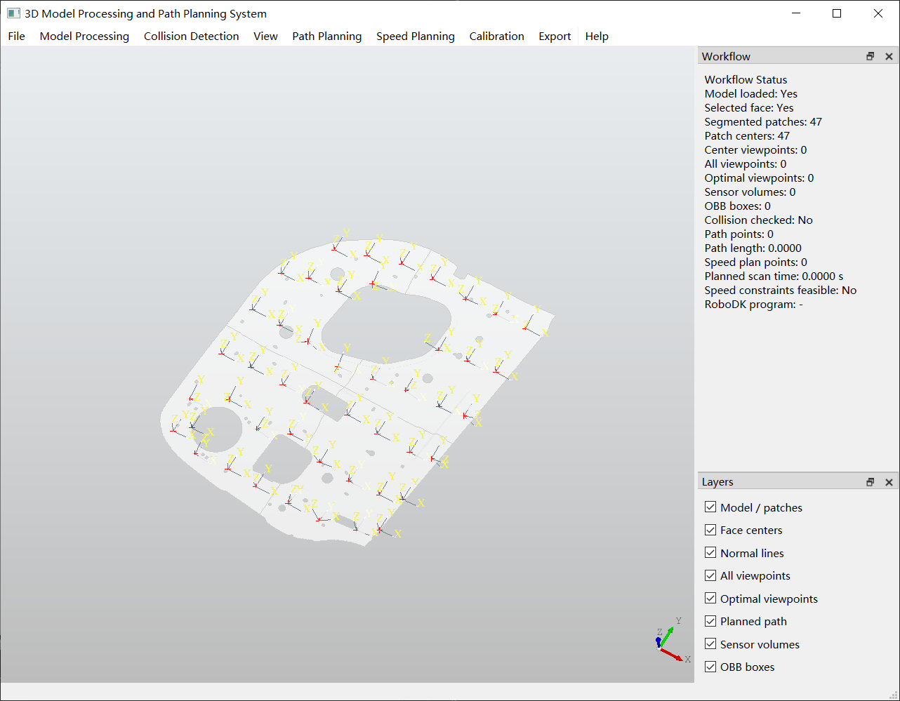
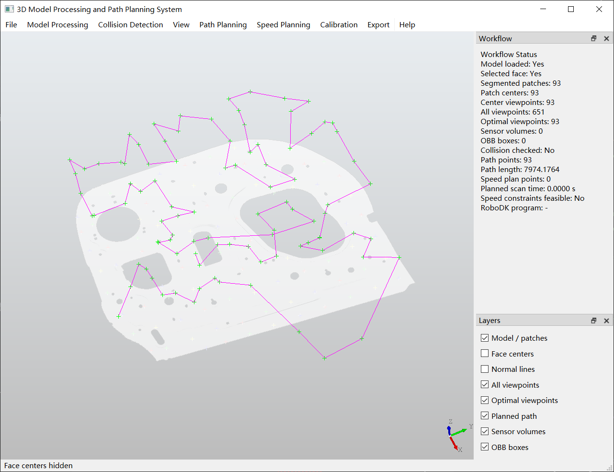
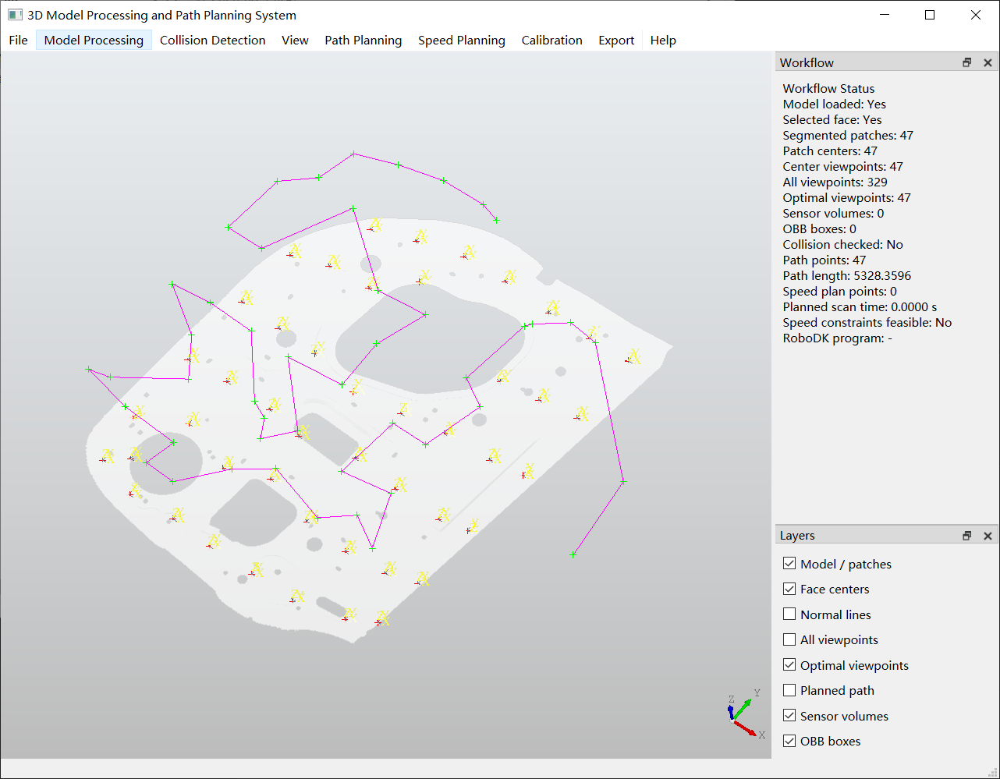

# 3D 模型处理与扫描测量路径规划系统

[English](README.md) | **中文**

本项目面向**机器人扫描测量路径规划**研究，构建了一个基于 CAD 模型的桌面软件原型，将三维模型处理、曲面分割、扫描视点生成、开放路径优化、速度规划、位姿变换以及 RoboDK/UR10 可达性分析集成于统一工作流中。

## 软件演示

以下三张截图展示软件工作流中的代表性阶段，包括表面采样/视点生成，以及不同分割参数下的路径规划结果。

### 1. 表面采样与视点生成

<p align="center">
  
</p>

### 2. 93 个分割面片下的路径规划结果

<p align="center">
  
</p>

### 3. 47 个分割面片下的路径规划结果

<p align="center">
  
</p>

## 主要功能

- **三维 CAD 模型处理**
  - 基于 OpenCASCADE / PythonOCC 的 CAD 模型加载与三维显示。
  - 曲面分割与工件坐标系构建。
  - 支持模型、视点、路径及相关几何对象的图层/显示管理。

- **扫描视点生成**
  - 基于曲面法向的扫描视点生成。
  - 支持中心视点与多候选视点生成。
  - 对候选视点进行筛选，并保留位姿及其 CAD 面片来源信息，为路径规划与机器人可达性验证提供输入。

- **路径规划**
  - 顺序连接开放路径。
  - 贪心最近邻开放路径。
  - 人工蜂群算法（ABC）。
  - 多策略组合遗传算法（MSCGA，Multi-Strategy Combined Genetic Algorithm）。
  - MSCGA 集成多种交叉/变异算子，并结合 **2-opt 局部搜索**进行开放路径优化。

- **速度规划与数据导出**
  - 对规划路径进行速度规划与可视化。
  - 支持 CSV 导出，便于后续实验分析及机器人执行流程使用。

- **RoboDK / UR10 集成**
  - 将规划路径及速度规划结果导入 RoboDK。
  - 读取并管理 RoboDK 工作站中的机器人、参考坐标系与工具映射。
  - 加载扫描仪到机器人工具端的外参，并对规划位姿进行坐标变换。
  - 基于 RoboDK 逆运动学、模型关节限位及正运动学回验残差进行 UR10 路径点可达性检查。
  - 对不可达路径点，可从**同一 CAD 面片**的候选视点中搜索可达替代点，并综合局部路径长度变化与关节跳变进行选择；修复完成后可选择保持当前路径顺序或重新规划。

- **中英文界面与测试**
  - `locales/` 中维护中英文界面资源。
  - 已包含路径相关工具、曲面分割、速度规划、RoboDK 集成、可达性修复、国际化及工件坐标系等单元测试。

## 典型工作流程

```text
导入 CAD 模型
      ↓
曲面分割 / 工件坐标系构建
      ↓
生成候选扫描视点
      ↓
筛选视点并保留位姿信息
      ↓
开放路径规划
（顺序 / 贪心 / ABC / MSCGA）
      ↓
速度规划
      ↓
位姿 / 标定坐标变换
      ↓
导入 RoboDK
      ↓
UR10 可达性检查
      ↓
不可达点修复 / 可选重新规划
      ↓
数据导出与后续验证
```

## 路径规划算法

| 方法 | 在软件中的定位 | 主要特点 |
| --- | --- | --- |
| 顺序连接 | 基线方法 | 保持原始视点顺序 |
| 贪心算法 | 快速启发式方法 | 每次选择距离当前点最近的未访问视点 |
| ABC | 元启发式对比方法 | 基于人工蜂群机制进行三维开放路径优化 |
| MSCGA | 主要研究算法 | 组合 Ordered/PMX/Cycle 等交叉方式、多种变异算子及 2-opt 局部搜索 |

本仓库定位为实验研究平台，因此算法参数和评价指标可根据不同待测件、扫描设备及实验任务进一步调整。

## 项目结构

```text
.
├─ main.py                    # 主界面及整体业务流程
├─ app_bootstrap.py           # 当前开发环境启动引导
├─ cad_io.py                  # CAD 模型读取
├─ geometry.py                # 几何计算工具
├─ surface_segmentation.py    # 曲面分割
├─ viewpoints.py              # 视点生成与筛选
├─ planning.py                # 顺序、贪心、ABC、MSCGA 路径规划
├─ speed_planning_core.py     # 速度规划计算
├─ speed_planning_ui.py       # 速度规划界面
├─ pose_transform.py          # 位姿与标定坐标变换
├─ robodk_bridge.py           # RoboDK 接口与兼容层
├─ reachability_repair.py     # UR10 不可达路径点修复
├─ i18n.py                    # 国际化
├─ locales/                   # 中英文界面资源
├─ tests/                     # 单元测试
└─ docs/                      # 用户/开发文档
```

## 运行当前开发版本

当前仓库主要在 **Windows** 环境下，基于既有 Conda/PythonOCC 环境进行开发与验证。

可使用仓库中的启动入口：

```powershell
.\start_software.cmd
```

或：

```powershell
.\run_integrated_app.ps1
```

当本地 PythonOCC/RoboDK 环境已经正确配置时，也可使用：

```powershell
python app_bootstrap.py
```

### 当前环境说明

仓库中的 `app_bootstrap.py` 反映了作者当前开发机的环境复用方案，其中包含 PythonOCC 与 RoboDK 的默认本机路径。这些路径**不是可直接迁移到其他计算机的通用配置**；在其他环境部署时，应根据本机安装位置进行调整，并优先使用项目支持的环境变量/配置方式。

相关说明：

- [`docs/user/ENVIRONMENT_NOTES.md`](docs/user/ENVIRONMENT_NOTES.md)
- [`docs/user/README_INTEGRATED.md`](docs/user/README_INTEGRATED.md)
- [`docs/README.md`](docs/README.md)

## 验证边界

当前 RoboDK 可达性检查用于验证配置机器人模型下的：

- 逆运动学是否存在有效解；
- 是否满足模型关节限位；
- 正运动学回验残差是否满足要求。

该结果**不能等价于真实机器人系统的完整可执行性与安全性验证**，尤其不能替代：

- 机器人与环境的完整碰撞安全验证；
- 动力学、加速度、jerk 与控制器约束验证；
- 扫描仪—机器人实体标定精度验证；
- 真实机器人执行安全验证。

在实体设备部署前仍需结合仿真与实验进行进一步验证。

## 当前研究状态

仓库目前已经形成从 CAD 模型处理到机器人侧路径验证的集成软件原型。后续研究可进一步围绕以下方向展开：

- 路径平滑以及位置/姿态连续插值；
- 路径长度、姿态变化与实际执行特性的多目标联合优化；
- 面向碰撞与动力学约束的可行性检查；
- 不同复杂待测件上的定量对比实验；
- 与真实扫描测量结果相结合的闭环实验验证。

## 说明

本仓库属于科研与开发项目。与硬件相关的本机路径、RoboDK 工作站名称、标定数据以及机器人参数均应在具体部署环境中重新核验。
